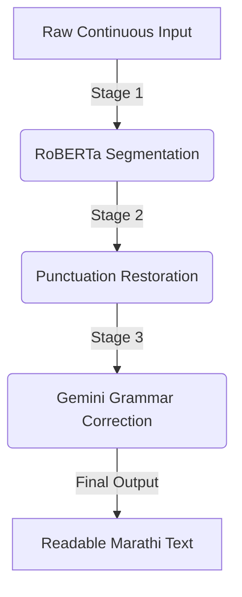

# LipiBook AI: Deep Learning Framework for Segmentation & Restoration of Continuous Marathi Text

## 📜 Project Overview

**LipiBook AI** is a specialized Machine Learning subsystem designed to solve the **Scriptio Continua** (continuous writing) problem in historical Marathi manuscripts (Modi script).

Historical documents digitized via OCR often result in a continuous stream of characters without spaces (e.g., `शिवाजीमहाराजांनीस्वराज्याचीस्थापनाकेली`). This project provides an end-to-end pipeline to:

1. **Segment** the continuous text into linguistically correct words.
2. **Restore** missing punctuation.
3. **Correct** grammatical and spelling errors using a hybrid LLM approach.

## 🏗️ System Architecture

The pipeline consists of three distinct stages, moving from structural segmentation to semantic polishing.



## 🚀 Key Resources & Links

| Component | Description | Link |
|---|---|---|
| **Fine-Tuned Model** | The core RoBERTa model trained for segmentation. | [Kaggle Dataset](#) |
| **Stage 2 Code** | Punctuation Restoration implementation. | [Colab Notebook](#) |
| **Stage 3 Code** | Grammar Correction & Dictionary Logic. | [Colab Notebook](#) |

# CORRECT LINKS ALREADY IN THE SHARED REPORT

## 🛠️ Methodology by Stage

### Stage 1: Structural Segmentation (Fine-Tuning)
- **Model**: `l3cube-pune/marathi-roberta` fine-tuned as a Token Classifier.
- **Technique**: BIO (Beginning-Inside-Outside) Tagging.
- **Training**: Trained on 1.6 million synthetically degraded sentences (spaces removed) to force the model to learn word structures.
- **Performance**:
  - **F1-Score**: 0.9998
  - **Accuracy**: 0.9999

### Stage 2: Punctuation Restoration
- **Model**: `ModelsLab/punctuate-indic-v1`
- **Function**: Injects punctuation (full stops, commas) into the segmented text stream where OCR usually misses them.

### Stage 3: Grammar Correction & Dictionary Lookup
This stage polishes the text using a dual approach:

#### 1. Modi-to-Marathi Dictionary
- **Problem**: Historical Modi words (archaic vocabulary) are often misinterpreted by modern LLMs or OCR.
- **Solution**: A custom dictionary (**Shabdkosh**) maps specific Modi terms to their modern Marathi equivalents. This ensures that domain-specific historical terms are preserved or translated correctly before the LLM touches them.
- **Implementation**: OCR-extracted text is first checked against this dictionary to handle edge cases that the model might miss.

#### 2. LLM Agent (Gemini 2.0 Flash)
- **Role**: Final grammatical proofreading.
- **System Prompt**: Strictly constrained to fix gender, tense, and case errors without hallucinating or changing the original meaning.

## 💻 Installation & Usage

1. **Clone the repository**:
   ```bash
   git clone https://github.com/yourusername/LipiBook-AI.git
   cd LipiBook-AI
   ```

2. **Install dependencies**:
   ```bash
   pip install -r requirements.txt
   ```

3. **Run the Interactive Test**:
   ```bash
   python test_interactive.py
   ```
  


## 📄 License

This project is licensed under the MIT License - see the LICENSE file for details.
